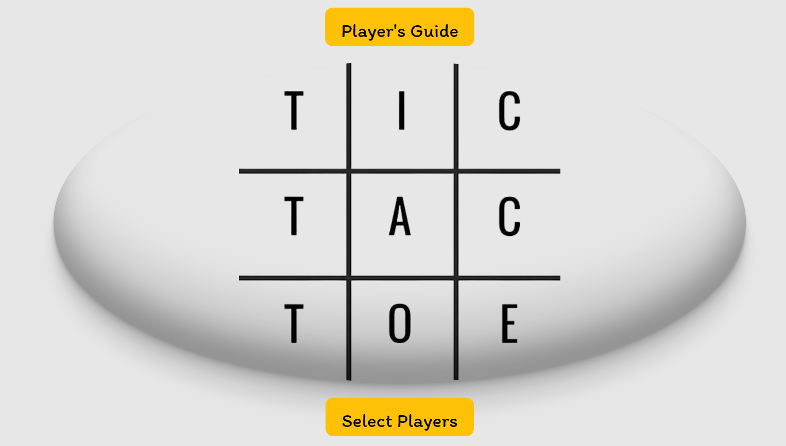

<h1 align="center">TIC TAC TOE</h1>
<p align="center"></p> 


## Description
---
<p align="center">This week's challenge proposed by GeekHubs academy is to build a tic tac toe game from scratch. Containing the following requirements:
<ul>
  - has to be functional and responsive.<br>
  - at least 4 pages: Home/ Players/ Game/ Winner.<br>
  - All pages must be connected to each other. 
</ul>
</p>

## Player´s Guide
---
|The game is played on a grid that's 3 squares by 3 squares.||
|-|-|
||You are X, your friend (next player) is O. Players take turns putting their marks in empty squares.|
|The first player to get 3 of her marks in a row (up, down, across, or diagonally) is the winner.||
||When all 9 squares are full, the game is over. If no player has 3 marks in a row, the game ends in a tie.|
More views in the game
| |||
|-|-|-|
## Built With
This project was built using these technologies.
<ul>
- HTML<br>
- CSS<br>
- JavaScript<br>
</ul>

## Install
---
* Clone this repository using your terminal of choice
  > `$git clone https://github.com/LauraSanchezLucas/lsl-geekhubs-proyecto-tic-tac-toe.git`


#### Follow these commands step by step:-

```bash
git@github.com:LauraSanchezLucas/lsl-geekhubs-proyecto-tic-tac-toe
```


Now you can open `index.html` in your browser to see Tic Tac Toe up and running.

Enjoy playing it.

## Play at
--- 

- https://laurasanchezlucas.github.io/lsl-geekhubs-proyecto-tic-tac-toe/
  
## Author
---
Laura Sánchez Lucas

## Additional information
---
The confetti is taken from the following library: https://www.npmjs.com/package/js-confetti?activeTab=readme
## Licencia 
---
This project is [MIT](https://opensource.org/licenses/MIT) licensed.


